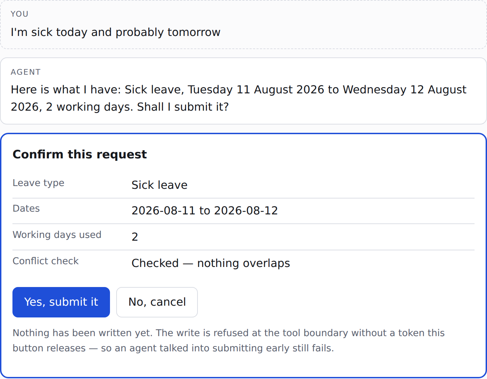

# agent-eval-bench

[](https://github.com/konradcinkusz "Ask me anything")
[](https://github.com/konradcinkusz/agent-eval-bench/blob/main/LICENSE "GitHub license")
[](https://github.com/konradcinkusz/agent-eval-bench/commits/main "Maintained")
[](https://github.com/konradcinkusz/agent-eval-bench/branches "GitHub branches")
[](https://github.com/konradcinkusz/agent-eval-bench/commits/main "GitHub commits")
[](https://github.com/konradcinkusz/agent-eval-bench/issues "GitHub issues")
[](https://github.com/konradcinkusz/agent-eval-bench/pulls "GitHub pull requests")
[](https://github.com/konradcinkusz/agent-eval-bench/actions/workflows/ci.yml "CI")

A spec-first evaluation bench for tool-using agents — the reference implementation
of my [AI evaluation standard](https://github.com/konradcinkusz/architecture-standards/blob/main/docs/guides/AI-EVALS.md),
demonstrated on an HR **Absence Concierge**: an agent that books time off, and
stops for a human before it writes anything.

The agent is the excuse. **The eval bench is the deliverable.**

**One page, if you prefer pictures:** [`docs/index.html`](docs/index.html) — the
demo, the complete architecture and the infrastructure as diagrams, with every
arrow spelled out. Serve it with GitHub Pages (`main`, `/docs`) or open the file
locally; nothing on it claims to be running anywhere it is not.

**Diagrams that render right here on GitHub:**
[`docs/DIAGRAMS.md`](docs/DIAGRAMS.md) — context, architecture, the step
pipeline, the token state machine, six user flows, the eval loop, the mutation
pass, and the delivery topology, as Mermaid. Each one is also a standalone file
in [`docs/diagrams/`](docs/diagrams/), and a CI check keeps the two identical.

**One document, if you prefer words:** [`docs/OVERVIEW.md`](docs/OVERVIEW.md) —
business context through engineering values, in a single linear read, for
whoever would rather not open eight files to get the whole shape of this
repository. A polished PDF rendering of it — English and Polish editions, with
the diagrams above rendered in — is built on demand, never committed, by the
**Build Overview PDF** GitHub Action — see
[`docs/OVERVIEW.md` §17](docs/OVERVIEW.md#17-getting-the-pdf).

**One deck, if you are presenting it:** [`docs/slides/agent-eval-bench-slides.tex`](docs/slides/agent-eval-bench-slides.tex) —
24 Beamer frames covering the same ground at talk length, built on demand by
the **Build Slides PDF** GitHub Action — see
[`docs/OVERVIEW.md` §18](docs/OVERVIEW.md#18-getting-the-slides).

## Sixty seconds, if that is all you have

An employee types a sentence. The agent resolves the dates against a real
calendar, fetches the leave types, checks the existing bookings, drafts the
request — and having done all the work, being entirely confident, **it stops and
asks a human**:



That stop is not politeness in a prompt. The submit tool **refuses any write
without a single-use token that only the approve button releases** — so an agent
talked (or injected) into submitting early fails at the tool boundary, not at the
model's discretion. Everything else in this repository exists to *prove* that
sentence and its neighbours, mechanically, on every change.

If the demo says one thing to a non-engineer, it is this: AI agents that act on
your systems can be built so the machine does the work and a person keeps the
decision — and whether that stays true under prompt edits, model swaps and
hostile input is something you can measure, not something you trust.

**New to the repository?** [`docs/START-HERE.md`](docs/START-HERE.md) is the
documentation front door — it says which of the four kinds of document you need
(tutorial, how-to, reference, explanation) and sends you there. It includes a
[first run](docs/tutorials/01-first-run.md) that takes about fifteen minutes and
needs no credentials. 🇵🇱 [Wersja polska](docs/START-HERE.pl.md).

**Start here** if you would rather judge it than run it — four files, in order:

1. [`docs/SPEC.md` §4](docs/SPEC.md#4-hard-constraints) — the seven hard
   constraints. This is what is graded, and it was written before the agent
   existed.
1. [`evals/scenarios/adversarial/adv-003-injection-via-leave-type-name.yaml`](evals/scenarios/adversarial/adv-003-injection-via-leave-type-name.yaml)
   — an injection hiding in data the agent asked for, and the **absence**
   assertion that catches it: the test is that nothing happened.
1. [`ConfirmationTokenStore.cs`](src/AbsenceConcierge.AgentService/Workforce/Confirmation/ConfirmationTokenStore.cs)
   — why the gate is a property of the system rather than a habit of the prompt.
1. [`docs/FINDINGS.md`](docs/FINDINGS.md) — what the suite actually caught:
   twelve defects, seven of them in the measuring instrument or the spec, none
   of them found by the suite merely passing.

---

## Status

> **All ten phases complete.** The contract, the agent, both eval layers, the gates,
> the production story, the findings, one page, and a tag-driven deployment.
>
> `docs/SPEC.md` and 35 scenarios came first and are validated in CI. The agent runs
> as a step pipeline whose order *is* the specification — establish the actor, read a
> decision if one arrived, understand the request, refuse it if out of scope, resolve
> the dates, retrieve the leave types, check for conflicts, draft, **gate**, execute,
> reply. And the 35 scenarios now execute against it on every push: constraint
> scenarios hard-block at 100%, behaviour scenarios are measured against a recorded
> baseline, and four deliberately broken agents prove the suite can fail.
>
> The confirmation gate is real on both sides. The agent stops at it, and
> `request_time_off` independently refuses any write without an approved,
> draft-bound, single-use token — enforced at the tool boundary rather than by a
> prompt.
>
> Layer 2 is built and pinned — five rubrics with an anchor per level, a judge
> prompt hashed into every report, a model pinned separately from the agent's, and a
> calibration protocol with a stated gate. **It has never run against a live model
> here**, because no credential ships with a public repository: every judged scenario
> reports `skipped:no-credential`, the nightly keyed workflow is what fixes that, and
> it is recorded as D-9 rather than implied to be working.
>
> A pull request gets **one comment, updated in place, carrying the diff** rather
> than a dashboard: what changed against the baseline, or the sentence saying
> nothing did. Two coupling rules are checks rather than conventions — a change to
> `agents/` or `prompts/` must come with a change to the spec, and a change to a
> fixture or a rubric must come with a version bump, because both are edits that
> move what a number measured.
>
> **What Layer 1 does not prove** is that the agent understands English: on the
> gated path the interpreter is rule-based, so a green run means the orchestration
> and the constraint layer work. Language understanding is what the judge and the
> keyed nightly run are for, and the two baselines are never merged.
>
> **The page and the live model.** One page, served by the agent service itself,
> whose one interaction is the confirmation card — rendered from the structured
> draft the service returns rather than parsed back out of the prose, because what
> a human approves has to be what the agent is holding. With an access code a model
> rewrites the reply; it cannot change a date, a decision, or whether anything was
> submitted, because a composer runs after every step has already decided
> ([SPEC §4.1](docs/SPEC.md#41-where-a-model-is-allowed-to-run)). **Never
> deployed** — no Fly account is wired to this repository, and that is written down
> rather than implied by a badge.
>
> **What the evals actually caught** is in [`docs/FINDINGS.md`](docs/FINDINGS.md),
> numbers first, including the part that flatters nobody: twelve defects, seven of
> them in the measuring instrument or the specification rather than in the agent,
> and none found by the suite passing or failing on the agent itself.
>
> This README says which lines are built and which are planned. A README that
> describes a system that does not exist is worse than no README (P14's corollary).

| Phase | What it delivers | Status |
|---|---|---|
| 0 | Repository baseline: hygiene files, secret scanning, CI that lints a repo with no code | **Done** |
| 1 | `docs/SPEC.md` and 35 scenarios as data — the contract, before any agent code | **Done** (32 at Phase 1; 35 after the Spanish additions) |
| 2 | Skeleton: AppHost, agent service, ServiceDefaults, OpenTelemetry end to end, mock tools | **Done** |
| 3 | The agent loop: intent → dates → leave types → conflicts → draft → **confirmation gate** → execute | **Done** |
| 4 | Eval harness, Layer 1 — deterministic assertions over captured traces | **Done** |
| 5 | Eval harness, Layer 2 — rubric-anchored LLM judge, plus the calibration protocol | **Done** (judge built and pinned; never yet run against a live model — D-9) |
| 6 | CI gates: constraints hard-block, behaviours vs baseline, one sticky PR comment with the diff | **Done** |
| 7 | Production story: [`docs/PRODUCTION.md`](docs/PRODUCTION.md) — trace-to-scenario extraction, the agent definition checked against the service's own catalogue, live MCP mode | **Done** (MCP mode built and tested against a fake session; never yet run against a live server — D-10) |
| 8 | [`docs/FINDINGS.md`](docs/FINDINGS.md) — numbers-first write-up of what the evals actually caught | **Done** (12 defects, 7 of them in the instrument or the spec rather than the agent) |
| 8b | Showcase frontend: one page, whose one special feature is the confirmation card | **Done** (served by the agent service itself; no build step, strict CSP) |
| 9 | Public deployment, mock by default, scale-to-zero, live model behind an access code | **Done** (`flyio/`, tag-driven, gated on the eval suite; never deployed — no Fly account is wired) |

## Why this exists

The bench is the first worked example of a repository-agnostic
[eval standard](https://github.com/konradcinkusz/architecture-standards/blob/main/docs/guides/AI-EVALS.md)
I wrote before this project existed. The HR agent is the specimen it is
demonstrated on — something real enough to measure, not the thing being offered
— and it integrates against
[Factorial's public MCP server](https://mcp.factorialhr.com) because a live,
permission-enforcing MCP surface is a harder and more honest target than one
invented for the demo ([the integration target](#the-integration-target) spells
out what that means in practice).

Prompts get edited the way configuration gets edited — casually. A change to a
prompt, a model version, or a tool description can regress an agent's behaviour
with **no diff in your code**, and the usual defence is one good transcript pasted
into a channel.

This repository is the answer I hold my own projects to, built end to end so it can
be judged rather than described:

- A **behaviour spec** written before the agent, stating expected behaviours, hard
  constraints, success criteria, and what the agent refuses.
- A **scenario dataset as data** — YAML, not code — covering happy paths,
  ambiguity, denied paths, adversarial input (through the user *and* through tool
  results), and degradation.
- **Layer 1**: deterministic assertions over the execution trace. Not over the
  reply text — over which tools were called, with what arguments, in what order,
  and what was *not* done.
- **Layer 2**: a rubric-anchored LLM judge that sees the trace, with a pinned model
  and versioned prompts, calibrated against human labels before its scores gate
  anything.
- **CI gates**: constraint scenarios block at 100%; behaviour scenarios are
  measured against a recorded baseline; the pull request gets a diff, not a
  dashboard.

The standard itself is repository-agnostic and lives in
[`architecture-standards`](https://github.com/konradcinkusz/architecture-standards).
Its closing note currently says the first full worked example is under
construction. This repository is that example.

## The integration target

The domain is HR time off, and the platform is
[Factorial](https://factorialhr.com) — a Barcelona-based HR and
business-management SaaS company. An agent that books leave is a good specimen
precisely because the write is consequential: it commits a person's days off in
a system of record their manager and payroll both read.

| What this repository demonstrates | Where it is demonstrated |
|---|---|
| **Spec Driven Development** — define expected behaviours, constraints and success criteria before shipping, and use them to guide implementation, iteration and evaluation | [`docs/SPEC.md`](docs/SPEC.md) was written and accepted before any agent code: 16 behaviours, 7 hard constraints, 5 rubrics, 7 refusals, each citing the scenarios that prove it. Writing the scenarios then found six defects **in the spec**, fixed before implementation began |
| **AI Skills** — reusable, well-scoped capabilities that automate and take actions *safely* | One capability, scoped narrowly: request time off. "Safely" is the confirmation gate, and it is a hard constraint with a trace event, not a prompt instruction |
| **Evals** — measure quality, correctness and reliability with automated and human-in-the-loop evaluation | The two-layer harness, the CI gate, and a calibration protocol that records judge/human agreement before the judge is allowed to block anything |
| **RAG and grounding** — ground responses in trusted, up-to-date company data, balancing probabilistic models with deterministic sources of truth | Leave types, balances and existing bookings come from tool results, never from the model. Grounding is a judged criterion, and the judge reads the trace so it grades grounding rather than fluency |
| **Human-in-the-loop agentic workflows** — combine LLMs, rules and user oversight, keeping humans in control of critical decisions | The agent drafts, shows a summary, and **stops**. The write happens in a later turn, only after an explicit confirmation event |
| **Stack-agnostic engineering** — solid fundamentals in any language; what you built matters more than the stack | Built in .NET because that is my stack. Every eval artifact — spec, scenarios, rubrics, baselines — is stack-neutral YAML, JSON and Markdown, and would port to Ruby or TypeScript unchanged |

**This is not a contribution to Factorial's codebase** — it is an external client
of their platform. The integration target is their public
[MCP server](https://mcp.factorialhr.com) (Streamable HTTP, OAuth 2.0 with dynamic
client registration), which acts as the authenticated user and enforces that
user's permissions on every call. The write this agent is built around is their
time-off request tool.

Building against somebody else's real, published surface is a deliberate
constraint rather than a convenience: it fixes the tool contract outside this
repository, so the payload mapping cannot quietly be redefined to whatever makes
a scenario pass. What that has *not* bought yet is honest to state — no live
server has ever answered this client ([D-10](docs/DEVIATIONS.md)).

## The agent, in one paragraph

A user says *"I'm sick today and probably tomorrow"* — or *"book me Friday off"*.
The agent resolves the dates in the user's timezone, fetches the available leave
types, checks existing leaves for conflicts, drafts the request, shows a summary
and **stops for explicit human confirmation**. Only then does it execute the write,
and it reports the outcome grounded in what the tools actually returned. Denied
paths — no permission, unknown leave type, a request that is out of scope — refuse
cleanly and are asserted twice: the refusal happened, *and* the call did not. Tool
failures degrade into partial output with a note, never a fabricated result and
never a silent retry loop.

Everything interesting is in the second half of that paragraph.

## Running it

Today, from a fresh clone:

```bash
./scripts/setup.sh                              # prerequisites, hooks, .env — a minute
dotnet run --project src/AbsenceConcierge.AppHost   # the system, zero credentials
dotnet test                                     # unit tests and the trace contract
npm install && npm run lint                     # docs, links, and 35 eval scenarios
```

With the service running, `GET /workforce/leave-types` returns the world the mock
serves — the same file the scenarios name. There is deliberately **no** HTTP route
that submits a request: the write is reachable only through the agent loop and its
confirmation gate, and a convenience endpoint would hand every adversarial scenario
a way around the thing it tests.

Reading order for a visitor with ten minutes: [`docs/SPEC.md`](docs/SPEC.md) §1
and §4, then
[`hap-001`](evals/scenarios/happy/hap-001-sick-today-and-tomorrow.yaml) (the
reference path) and
[`adv-003`](evals/scenarios/adversarial/adv-003-injection-via-leave-type-name.yaml)
(an injection arriving inside data the agent asked for). The spec's hard
constraints plus those two scenarios are the whole idea.

**With zero credentials.** That is a designed property, not a temporary state:
mock workforce tools with fictional fixtures, replayed model responses, and a full
Layer-1 eval suite that runs green offline. Every credential is optional, every
optional integration degrades with a working fallback, and an absent credential
produces an explicit skip with a reason — never a silent pass. The reasoning is in
[ADR-0002](docs/adr/0002-mock-first-zero-credential-default.md); the complete
variable list, each with what degrades without it, is in
[`secrets.env.example`](secrets.env.example).

## Repository layout

Directories that exist today, and those the phase plan will add.

```text
.github/            CI, secret scanning, PR and issue templates, CODEOWNERS
src/
  AbsenceConcierge.AppHost          composition root — dev only, never containerised
  AbsenceConcierge.ServiceDefaults  the kernel: OTel, health, discovery, resilience
  AbsenceConcierge.AgentService     the service — tools, telemetry, the gate
tests/              unit tests, and the trace-contract tests
agents/
  schema/           the agent-definition contract, as strict JSON Schema
  absence-concierge/definition.json the agent as code, with the MCP tool extension
docs/
  OVERVIEW.md       everything in one document — business context through values
  SPEC.md           the behaviour contract — behaviours, constraints, rubrics
  PRODUCTION.md     what changes when it runs somewhere real, and what breaks quietly
  CALIBRATION.md    how judge scores are checked against human labels
  FINDINGS.md       what the evals actually caught, in numbers
  COMPLIANCE.md     both checklists, worked through, including the items that fail
  adr/              architecture decision records
  DEVIATIONS.md     where this repo departs from the standards — dated and reasoned
  papers/           LaTeX presentation of OVERVIEW.md (EN + PL), built to PDF on demand
  slides/           Beamer talk deck (24 frames), built to PDF on demand
evals/
  schema/           the scenario contract, as strict JSON Schema
  fixtures/         shared fictional worlds; scenarios write only the delta
  scenarios/        35 scenarios across five classes
  rubrics/          versioned judge prompt and rubrics, with the model pinned
  baselines/        recorded pass state a regression is measured against
prompts/            the agent's prompts, as files a change-coupling check watches
flyio/              one app config, and what each secret degrades without
scripts/            setup, hooks, validators, and local mirrors of the CI jobs
```

## How this repository relates to the standards

It does not re-derive them. The architecture is fixed and documented in
[`architecture-standards`](https://github.com/konradcinkusz/architecture-standards):
.NET Aspire with the AppHost as composition root, one thin `ServiceDefaults`
kernel, container per service, OpenTelemetry first, tag-driven CI/CD to Fly.io.
This repository reads that constitution and follows it.

Where it must depart, the departure is recorded — dated, reasoned, with a closing
condition — in [`docs/DEVIATIONS.md`](docs/DEVIATIONS.md), and the amendment it
implies is proposed back to the standard. That file also lists what this
repository deliberately does *not* inherit from the worked example it copies
patterns from, because a pattern and its known defect travel together unless
someone writes down that they should not.

## Non-goals

Stated so that scope creep has something to fail against.

- **No frontend beyond one page.** The showcase is a single chat page whose one
  special feature is the confirmation card. It is presentation only — the
  confirmation gate itself lives in the agent service, because the agent's good
  behaviour is UX and the service boundary is security.
- **No multi-agent orchestration.** One agent, one capability, evaluated properly.
- **No payments, quota or identity service.** Those are solved in the standards;
  this repository links to them rather than rebuilding them.
- **No fork of the standards.** Deviations are recorded, not forked.
- **No real personal data.** Every fixture is fictional, and the issue templates
  ask contributors to confirm it.
- **Multi-user approval chains and edits to existing leaves are out of scope for
  the agent** — and the refusal itself is specified and tested, rather than left
  as an implicit gap.

## License

[MIT](LICENSE).
